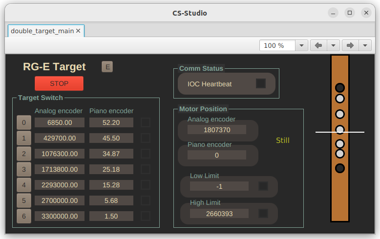

# Phoebus graphic interface

The user interface is intended to be viewed through CS-Studio Phoebus v4.7. From the main screen ``double_target_main.bob``, the rest of the screens can be accesed.

## Main screen

The main screen has at its left side the "Target Switch" panel, with a list of the seven existing solid targets, each with:
 - a button to center it
 - Its position, measured by analog linear potentiometer.
 - Its position, in [mm], measured by the "piano" (stepper) encoder.
 - A color indicator showing if the target is currently centered.

In order to center an specific target, all that is needed is to press its specific button.

Next to this panel, there is the "Motor Position" panel, with the current reading of every encoder, if the ribbon is being moved or still, and the position of both (backward and forward) limit switches. The analog encoder reading should be updated constantly. The piano encoder number is updated only during the last part of the movement. After a movement is finished, both readings should be similar to the reference positions in the "Target Switch" panel. The limit switches positions update when they are activated, with the reading of the analog encoder. Also, when activated, the color indicator next to the number should be turned on.

In the top part there's the communication status panel. It has a heartbeat-type signal that should turn on and off every second as long as the controller is working normally. This may stop for some time while there is some movement operation running, because the controller will be focused in the movement process.

At the right side, there is a visualization of the ribbon with all of the target ribbons. This is done by usin each target's position registered according to the analog encoder and it moves according to the analog encoder reading. The middle line should correspond to the beam, if the beam was centered (we're not directly reading beam deviation here)

In the upper left corner, there's a big red "stop" button. This should stop any movement almost immediatly.

Next to it there's the menu button, with the options to open the temperature interface and the expert interface.

## Temperature interface

Temperature interface revolves around a schematic of the Double Target system, featuring the cryogenic cell in the center (in light yellow) and the solid target system around it. At the top of the image in red, the motor, which has a temperature sensor and heater attached. At the bottom, in blue, the linear potentiometer also has a temperature sensor and heater attached.

Each of them is linked to a section showing the current temperature, the setpoint of the PID control and the output power of the heater. To modify this parameters, click the "Expert" button, which will open an additional temperature window.

## Temperature expert window

This interface has one section for each part (motor / potentiometer), and each of them has the temperature reading, the temperature setpoint (the minimum desired temperature we want to reach), the heater output power, the three PID parameters (proportional, integrative and derivative), a "range" parameter to turn off the heater or use it at low, mid or high power. There's also a manual output control, in heater power output percent, for open-loop control.

## Expert interface

Do not use.

If you think you should use it, call someone from the chilean group so they can confirm you not to use it.

In the remote case they tell you to actually open it, you should see a list of color indicators, the readings of all the encoders and a command terminal.

Most of the indicators are taken directly from the PMD-301 motor controller. For more information on them, look for its corresponding manual. "Limit reached" indicates when the limit switches are activated and it has directional indicators so you will know which of the limits is active. An arrow to the left corresponds to a backward limit activation and an arrow to the right corresponds to a forward limit activation.
