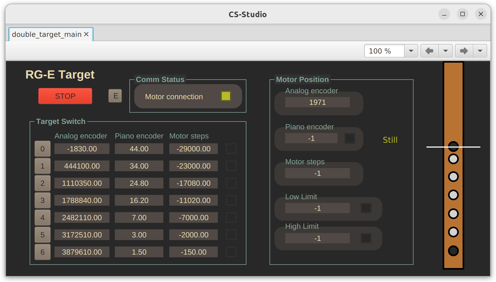
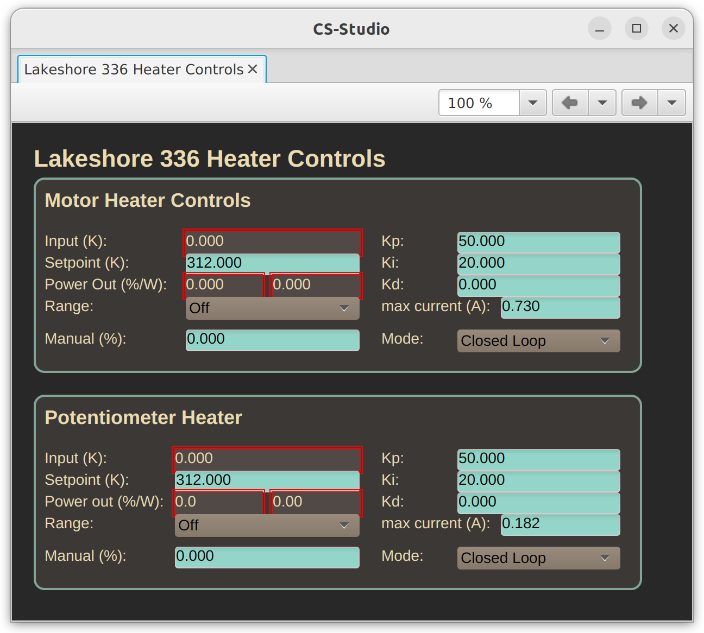

# RG-E Solid target system graphical user interface

Read this if you want to know how to control the solid target system.

## Introduction
As you probably know, JLab's Hall B Run Group E experiment is a Double Target one. That means there is a cryogenic, liquid hydrogen target, and a second one, downstream, solid target. Solid target can be switched to different elements. Actually, there are seven possibilities: an empty target (0), lead (Pb), tin (Sn), copper (Cu), aluminum (Al), carbon (C) and an additional beam calibration target (X). The beam calibration target is an empty space crossed by two very thin tungsten cables, one at 90 degrees from the other. These seven targets are one next to each other in a ribbon which can be moved to put each of these at the center of the structure.

The ribbon is attached to a piezoelectric motor, which has a moving bar that can push and pull the ribbon. At the other side, the motor is attached to the "piano encoder" system, which has one millimeter pieces with alternate electrical charge, so we can count the steps while it is moving to know the current band position. At the other side of the band, there is a linear potentiometer used as analog encoder to double-check the band position.

All of this is connected to an "electric box" with a Raspberry Pi, a motor controller and other stuff in the experimental hall B.

The user interface is intended to be viewed through CS-Studio Phoebus v4.7. If you're reading this, you'll probably be using an older version of CS-Studio, so the screens will look uglier, but it should work the same way.

The main screen ``RG-E solid target`` is available in the ``Beamline`` subsystem menu in CS-studio, the rest of the screens can be accesed from that main screen.

## Main screen

The main screen has at its left side the "Target Switch" panel, with a list of the seven existing solid targets, each with:
 - A button to center it.
 - Its position, measured by analog linear potentiometer.
 - Its position, in [mm], measured by the "piano" (stepper) encoder.
 - Its position, measured in motor steps needed to reach that position.
 - A color indicator showing if the target is currently centered.

In order to center an specific target, all that is needed is to press its specific button.

Next to this panel, there is the "Motor Position" panel, with the current reading of every encoder, if the ribbon is being moved or still, and the position of both (backward and forward) limit switches. The analog encoder reading should be updated constantly. The piano encoder number is updated only during the last part of the movement. After a movement is finished, both readings should be similar to the reference positions in the "Target Switch" panel. The limit switches positions update when they are activated, with the reading of the analog encoder. Also, when activated, the color indicator next to the number should be turned on.

In the top part there's the communication status panel. It has a heartbeat-type signal that should turn on and off every second as long as the controller is working normally. This may stop for some time while there is some movement operation running, because the controller will be focused in the movement process.

At the right side, there is a visualization of the ribbon with all of the target ribbons. This is done by usin each target's position registered according to the analog encoder and it moves according to the analog encoder reading. The middle line should correspond to the beam, if the beam was centered (we're not directly reading beam deviation here)

In the upper left corner, there's a big red "stop" button. This should stop any movement almost immediatly.

Next to it there's the menu button, with the options to open the temperature interface and the expert interface.

## Temperature interface

Temperature interface revolves around a schematic of the Double Target system, featuring the cryogenic cell in the center (in light yellow) and the solid target system around it. At the top of the image in red, the motor, which has a temperature sensor and heater attached. At the bottom, in blue, the linear potentiometer also has a temperature sensor and heater attached.

Each of them is linked to a section showing the current temperature (in Kelvin), the setpoint of the PID control (in Kelvin) and the output power of the heater (in Watts). To modify this parameters, click the "Expert" button, which will open an additional temperature window.

## Temperature expert window

This interface has one section for each part (motor / potentiometer), and each of them has the temperature reading (in Kelvin), the temperature setpoint (the minimum desired temperature we want to reach) (in Kelvin), the heater output power (both in percentage of the maximum configured to the Lakeshore temperature controller and in Watts), the three PID parameters (proportional, integrative and derivative), a "range" parameter to turn `off` the heater or use it at `low` (1%), `mid` (10%) or `high` (100%) power, and a max current parameter setting. There's also a manual output control, in heater power output percent, for open-loop control.

Note that the heater output power in this screen is the power used by Lakeshore temperature controller. Part of it is wasted in the wires, and part of it actually reaches the heater. In the normal temperature interface you can see the power actually being used by the heater only.

## Expert interface

Do not use.

If you think you should use it, call someone from the chilean group so they can confirm you not to use it.

In the remote case they tell you to actually open it, you should see a list of color indicators, the readings of all the encoders and a command terminal.

Most of the indicators are taken directly from the PMD-301 motor controller. For more information on them, look for its corresponding manual. "Limit reached" indicates when the limit switches are activated and it has directional indicators so you will know which of the limits is active. An arrow to the left corresponds to a backward limit activation and an arrow to the right corresponds to a forward limit activation.

Below there are some settings parameters for the movement algorithm. `Motor gain` indicates how many motor steps correspond to one linear encoder step. A target change procedure starts with a fast and coarse approximation to the desired target, reaching a different position near the final one before doing a careful and slower movement toward the final destination. The difference between this breakpoint position and final desired position is the `overstep` parameter. During the last phase of mevement, the algorithm reads the analog encoder many times, and takes the mean value. `Noise supression` indicates how many times should it read the encoder to calculate the mean value. For every movement, a `speed` is instructed to the motor.

Normally these shouldn't be changed. The situation for changing them is when it takes too long to reach desired position, or if the first phase of movement gets too close to the desired position, so signal noise gets bigger than `overstep`, for example.

`active encoder` configures which encoder system should guide the movement. When `analog` is chosen, the linear analog potentiometer readings will be used to look for the right position. When `piano` is chosen, the stepper digital system will guide the movement with its one-millimeter steps. `motor` will use no encoder at all, and just instruct the motor to move a certain amount of motor steps. All of these systems have a reasonable precision, being `analog` the most precise as long as electromagnetic noise is not too great, all cables are properly connected and temperature in the system is stable. If any of these conditions are not met, consider changing to `piano` instead. This alternative encoder system is more stable at different temperatures and resistant to noise. Since `motor` provides absolutely no feedback, use it only when no encoder is working and try to repair the encoder as soon as it is possible to go to the experimental hall.

Below that there are four buttons. `Step bw.` ("step backward") moves the system `500` motor steps backwards. Right next to it there is a small `<` button that moves the system `50` motor steps backwards. Likewise, the small `>` button moves the system `50` motor steps forward and `Step fw.` ("step forward") moves it `500` motor steps forward.
These buttons can be used for calibration and testing, or manual movement in the case you decide to use any external system to check centering of the targets.

The ``Terminal`` section allows you to send commands directly to the PMD301 Piezomotor controller. **Caution!** If you send a text that's not a correct command, it might trigger an unexpected behaviour and the system might need to be rebooted. The terminal should only be used in extreme cases and with the utmost caution.

``Target positions`` panel allows for manual calibration of target reference positions according to each encoder system. For easy modification, there's an additional row `Apply offset`, which, when set to a non-zero value, will add the value to each target reference position.

Finally, ``Target Calibration`` algorithms use the forward and backward limit switches as reference to automatically re-calibrate the targets' positions. The ``Establish`` buttons are for setting the piano and motor reference positions according to the analog encoder ones. ``Auto calibration`` executes the calibration algorithm before each movement.
**Warning!** The calibration algorithms were not properly tested, so it must be discussed with chilean target group if it is a good idea to use them, so they can give you proper advice on how to use this section and how to check if it worked properly.